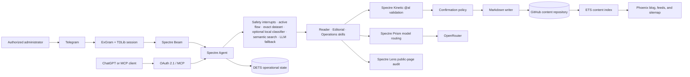

# ExBlog

> A Git-native editorial agent built with Phoenix and the Spectre ecosystem.

ExBlog is a working showcase of an agent that does more than answer questions.
As the administrator, you talk to it through Telegram or MCP: it walks you
through a guided editorial workflow, drafts multilingual content with
OpenRouter, asks you to approve every repository change, and publishes a real
Markdown article. GitHub remains the canonical content store; Phoenix serves a
fast ETS projection without a SQL database.

The project brings the Spectre stack together in one deliberately visible
workflow:

- **Spectre Agent** owns routing, conversational state, memory, and execution;
- **Spectre Skills** separate reading, editorial work, and operations;
- **Spectre Kinetic** turns model output into validated `@al` actions;
- **Spectre Prism** selects fast, balanced, or deep OpenRouter models by purpose;
- **Spectre Beam** normalizes Telegram text and images through ExGram;
- **Spectre Lens** audits rendered public blog pages from inside the agent;
- **Spectre Work** runs the durable sync-and-verify maintenance procedure on
  the operational runtime;
- **HEEx prompt templates** keep prompts reviewable and next to their skill;
- **dataset-driven semantic routing** uses an ExBlog-specific English corpus,
  optional local classification in development, OpenRouter embeddings in
  production, and learns only safe read intents in DETS.

The agent operates in English. Articles, metadata, and translations can use any
language enabled in `EX_BLOG_SUPPORTED_LANGUAGES`.

## The showcase in one diagram



There are four different persistence responsibilities:

| Store | Responsibility |
| --- | --- |
| GitHub repository | canonical Markdown content and its history |
| ETS | replaceable, in-memory read projection for the public blog |
| `$EX_BLOG_DATA_DIR/runtime.dets` | agent state, semantic examples, budget ledger, OAuth token hashes, and operational records |
| `$EX_BLOG_DATA_DIR/telegram/<session>` | persistent TDLib authorization database |

Article images are content-addressed on the data volume and restored into
`priv/static/images/articles` at boot.

## How the agent works

The agent treats every administrator message as a routing problem, not as a
chat completion. When a message arrives, it walks down an ordered list of
questions, from the cheapest and most predictable to the most expensive, and
stops at the first confident answer:

1. **Is it a safety interrupt or a cancellation?** Prompt-injection patterns
   and the natural phrases `stop`, `cancel`, and `never mind` are matched by a
   handful of regex guards. This is hard evidence: when one matches, no model
   is consulted at all. Nothing else in the agent is command-shaped — there
   are no bot-style `/commands` to memorize.
2. **Is a conversation already in progress?** If the article wizard is waiting
   for a title, the next free-text message *is* the title. The persisted flow
   cursor claims that reply directly instead of sending it to a classifier
   that would have to guess what it means.
3. **Has this exact sentence been seen before?** The versioned English dataset
   and previously verified learned phrases answer exact matches from cache,
   with no inference of any kind.
4. **Does the local classifier recognize the phrasing?** In development and
   test, a small locally trained model routes known paraphrases without a
   network call. It answers only when clearly confident; otherwise it steps
   aside. Production does not ship this model.
5. **Is it close to something the agent already learned?** The message is
   embedded once and compared against stored request vectors; a close enough
   match reuses the earlier routing decision.
6. **Only then, ask a model.** When every cheaper signal misses or providers
   disagree, one fast OpenRouter completion classifies the intent.

Understanding a request is deliberately separate from acting on it. Whatever
path routing takes, a write still becomes a typed Kinetic action, is validated
against the `@al` catalog, and waits for an explicit `yes` or `confirm` before
anything touches Git. A learned shortcut can speed up understanding; it can
never skip a confirmation.

The rest of this section describes the pieces that make this behavior
concrete.

### Skills and nested flows

Instead of one monolithic prompt, the agent is split into three skills, each
owning a coherent slice of the work.
[`ExBlog.Agent`](lib/ex_blog/agent.ex) installs them:

| Skill | Scope |
| --- | --- |
| `reader` | list, read, search, and audit public blog pages |
| `editorial` | create, revise, translate, optimize, publish, unpublish, and delete |
| `operations` | safe configuration, provider health, budget, and Git synchronization |

The article-creation conversation is implemented as nested Spectre flows:

```text
article_creation
├── article_brief
├── article_language
├── article_category
├── article_title
└── article_seo
```

`Spectre.State.current_flow` is the cursor. A free-text answer is therefore
interpreted as the field currently being requested instead of being sent back
through a generic classifier. Cancellation phrases and authenticated Telegram
images are global interrupts, so they remain available at every step.

The implementation is in
[`editorial.ex`](lib/ex_blog/agent/skills/editorial.ex).

### HEEx prompts

Agent copy and model instructions are HEEx templates under
[`lib/ex_blog_web/prompts`](lib/ex_blog_web/prompts). The agent has one prompt
root, while each skill can declare its own nested root. This keeps prose out of
the workflow module, supports small prompt-specific assigns, and makes every
prompt independently reviewable.

Renderer templates for article generation, revision, translation, SEO, title,
category, and classification are separate from conversational prompts. Values
inserted into them are bounded, escaped, and stripped of configured secrets.

### Kinetic Action Language

The model is not allowed to call arbitrary Elixir functions. Kinetic exposes a
typed catalog from
[`kinetic_actions.ex`](lib/ex_blog/agent/kinetic_actions.ex), validates the
generated Action Language against the declared `@al` signatures, and only then
hands the action back to Spectre.

Examples of canonical AL:

```text
LIST ARTICLES
READ ARTICLE LANG="en" SLUG="spectre-agents"
SEARCH ARTICLES QUERY="Telegram editorial workflow"
CHECK BLOG PAGE URL="https://blog.example.com/en/spectre-agents"
CREATE ARTICLE TITLE="Building a Spectre agent" LANG="en" CATEGORY="Engineering" BRIEF="Explain the architecture" GENERATE_SEO=true COVER="" COVER_ALT=""
REVISE ARTICLE LANG="en" SLUG="spectre-agents" INSTRUCTIONS="Add a deployment section"
TRANSLATE ARTICLE LANG="en" SLUG="spectre-agents" TARGET_LANG="it"
GENERATE ARTICLE SEO LANG="en" SLUG="spectre-agents"
PUBLISH ARTICLE LANG="en" SLUG="spectre-agents"
UNPUBLISH ARTICLE LANG="en" SLUG="spectre-agents"
DELETE ARTICLE LANG="en" SLUG="spectre-agents"
SYNC BLOG REPOSITORY
```

The administrator never types this syntax: they ask in plain English, and
Kinetic AL is the validated internal contract between planning and execution.

### Policies before side effects

Create, revise, translate, generate SEO, publish, unpublish, delete, and
repository synchronization are protected Spectre actions. The agent stages the
effect, shows what it is about to do, and waits: only a plain `yes` or
`confirm` from the administrator executes it, `no` or `cancel` rejects it, and
three invalid confirmation attempts cancel the operation. No model output can
approve a staged action.

Read actions never mutate Git. Semantic learning is also restricted to
explicitly learnable read routes, so a learned match can never approve a write.

### Prism model routing

Prism selects a model tier by purpose:

| Tier | Typical work |
| --- | --- |
| fast | fallback classification and category generation |
| balanced | title generation, SEO, normal revisions, and page assessment |
| deep | complete articles, translations, and complex editorial work |

Budget checks happen before balanced or deep requests. Model identifiers remain
runtime configuration, so changing providers or models does not alter the
skills.

### A durable Work: sync and verify

Conversational turns are short-lived; maintenance is not. For procedures that
must outlive one reply, Spectre provides `Spectre.Work`: a versioned,
deterministic state machine whose registered operations run on the shared
operational runtime. ExBlog ships one as a showcase,
[`SyncAndVerify`](lib/ex_blog/agent/works/sync_and_verify.ex):

```text
Administrator: Sync the repository and verify all public pages.
Agent: Sync and verification started. …

sync_repository → collect_pages → audit_page (one per URL) → report
```

The Work owns a closed catalog of three operations, implemented in
[`Verification`](lib/ex_blog/agent/verification.ex):

| Operation | Effect | Classification |
| --- | --- | --- |
| `sync_repository` | the same fetch/reset/rebuild the periodic sync performs | idempotent, retried once |
| `collect_pages` | bounded list of public URLs from the ETS index, at most 16 | pure read |
| `audit_page` | one Spectre Lens audit per page, deterministic checks only | idempotent, retried once |

The controller callbacks (`init`, `next`, `apply_result`, `complete`) are
deterministic reducers: they only decide *which* operation runs next, while
the operational runtime executes attempts, applies retry policy, and commits
every transition. The Work performs no Git push and no model inference, so it
needs no policy confirmation and spends no OpenRouter budget; a page that
fails to load is recorded as unhealthy instead of aborting the run.

The agent side is two ordinary routes in the operations skill. `VERIFY_BLOG`
uses the `work(...)` handler, which starts the loop on the blog's Agent
Instance and immediately acknowledges the conversation; `SHOW_VERIFICATION`
is a cacheable read that projects the newest committed loop view — status,
phase, page counts, and the problems found — back into a reply:

```elixir
on :VERIFY_BLOG, embedding: [...], cache: false,
  via: [:embedding, :classifier, :llm_classifier] do
  work(SyncAndVerify, input: %{}, reply: :verification_started)
end
```

The Instance is supervised under `ExBlog.SpectreSupervisor` and created
lazily by [`Instance`](lib/ex_blog/agent/instance.ex). It holds only
in-memory operational state: restarting the application loses a running
verification loop but never blog content.

### Dataset-driven routing plus semantic reuse

Routing is deliberately multi-provider: regex is reserved for safety
interrupts and cancellation phrases, and everything that needs actual
language understanding falls through to progressively smarter — and more
expensive — providers:

```text
safety or cancellation regex → active nested-flow continuation
→ exact versioned dataset / verified cache → optional static embeddings
→ optional local classifier → vector semantic search → arbitration
→ remote LLM classifier fallback
```

Every skill route declares its own `via:` list. Read routes expose
`[:embedding, :classifier, :semantic_cache, :llm_classifier]`; editorial and
Git mutations expose optional static embeddings, the trained classifier, and
the LLM classifier but exclude semantic-cache learning; intake capture leaves
expose only the private `:creation_continuation` provider.

The agent enables `[:regex, :classifier, :semantic_cache, :llm_classifier]`
globally; `:regex` stays in that list only for the safety and cancellation
interrupts. `:embedding` remains an opt-in static matcher because it embeds every
visible skill example during a request. The local-classifier provider is part
of the pipeline but can report itself unavailable, allowing semantic search and
the remote classifier to continue normally.

Embedding policy is environment-specific, following the same separation used
by the reference Freelance application:

| Environment | Spectre embedding boundary | Local classifier |
| --- | --- | --- |
| development/test | ExFastembed with `intfloat/multilingual-e5-small` at 384 dimensions | optional, trained locally |
| production | `ExBlog.AI.Embedding` through OpenRouter/Req at the configured dimensions, 1024 by default | disabled and not shipped |

`ex_fastembed` is a development/test-only dependency with `runtime: false`.
The production image contains no Rust toolchain, native model cache, classifier
artifact, or local semantic-vector mirror. `ExBlog.Agent.Embedding` dispatches
to OpenRouter in production, so learned semantic rows use the hosted model and
the same budget ledger as other provider calls.

During local training, the shared boundary applies E5's `query:` prefix to both
training and inference. A centroid head keeps the artifact compact; score and
margin gates make ambiguous predictions fall through instead of treating them
as authoritative. Hosted models receive the original redacted text without the
E5-specific prefix.

The checked-in [`dataset.json`](priv/spectre/dataset.json) contains 228 original
English examples: 12 for each of the 19 classifier-visible ExBlog intents. The
dataset includes contrastive cases such as reading versus searching, auditing
an existing page versus generating SEO, and publishing versus repository
synchronization. Capture fields from the nested creation wizard are excluded
because the persisted flow cursor, not a model, owns those replies.

The optional development bootstrap produces two artifacts from the same
corpus under ignored `artifacts/spectre`:

- `classifier.etf`, used by the warm local intent classifier;
- `semantic_cache.jsonl`, containing precomputed local vectors for all 228
  examples; development boot filters them through route policy and warms
  Vettore with the 96 cacheable read examples.

Production does not load either artifact. It still reads the release-safe
dataset for exact matches. New eligible semantic rows are embedded through
OpenRouter and persisted in a namespace containing the hosted model and
dimension identity, so a DETS store cannot mix them with local 384d rows.

Spectre mirrors dataset rows into exact cache only when their route is
cacheable. Consequently, the eight read-only intents can answer exact matches
with no inference, while writes, deletes, sync, verification starts, unsafe
input, and unknown input train the classifier but can never become cached
authorization.

The provider responsibilities are:

| Provider | When it wins | External model call |
| --- | --- | --- |
| regex | a safety interrupt, a cancellation phrase, or the internal Telegram image marker matches | none |
| creation continuation | a persisted article-intake cursor owns the next free-text answer | none |
| semantic exact | a trusted dataset, skill, or verified learned phrase matches exactly | none |
| local classifier | a development/test artifact recognizes the intent above its score and margin gates | one local embedding; disabled in production |
| semantic search | a stored vector is close enough to the new request | local in development/test; one OpenRouter embedding in production |
| static embedding | explicitly enabled for experiments | selected environment adapter per visible example |
| LLM classifier | all local evidence misses or conflicts | one fast OpenRouter completion |

Interrupt regex evidence is always hard: an actual match stops probabilistic
routing outright, while a rule's embedding candidate remains subject to score
and margin thresholds. Global safety interrupts intentionally do not use
static embedding candidates because a low-score embedding candidate must
never turn an unrelated request into an interrupt.

The gates are strict on purpose. The local classifier must reach `0.89` with a
`0.008` margin over the runner-up label; optional static-embedding candidates
need `0.84` with a `0.03` margin; learned semantic matches need `0.94`
similarity. An unreviewed learned read intent becomes verified automatically
only at `0.985` similarity with at least a `0.05` margin over the next label.
A candidate that cannot clear its gate simply falls through to the next
provider instead of routing the request on a guess. Online learned rows and
their embeddings are persisted in DETS. Editorial mutations have
`learn: false` and still require policy confirmation.

### Reading the agent implementation

The code is split by responsibility so the declarative DSL does not hide side
effects:

| Module | Responsibility |
| --- | --- |
| [`ExBlog.Agent`](lib/ex_blog/agent.ex) | composition root: providers, pipeline, skills, state, and bindings |
| [`RouterPipeline`](lib/ex_blog/agent/router_pipeline.ex) | evidence ordering and LLM arbitration boundary |
| [`ClassifierConfig`](lib/ex_blog/agent/classifier_config.ex) | source/release paths and local-classifier boot configuration |
| [`LocalClassifier`](lib/ex_blog/agent/local_classifier.ex) | application-owned trained classifier boundary and recovery switch |
| [`Embedding`](lib/ex_blog/agent/embedding.ex) | environment-aware boundary: ExFastembed locally, OpenRouter in production |
| [`Reader`](lib/ex_blog/agent/skills/reader.ex) | cacheable read intents and Lens audit route |
| [`Editorial`](lib/ex_blog/agent/skills/editorial.ex) | nested creation flow and protected editorial intents |
| [`Operations`](lib/ex_blog/agent/skills/operations.ex) | diagnostics, protected repository synchronization, and verification routes |
| [`Works.SyncAndVerify`](lib/ex_blog/agent/works/sync_and_verify.ex) | durable sync-and-verify Work controller |
| [`Verification`](lib/ex_blog/agent/verification.ex) | registered operation executors for the verification Work |
| [`Instance`](lib/ex_blog/agent/instance.ex) | lazy Subject-scoped Agent Instance owning Work loops |
| [`KineticActions`](lib/ex_blog/agent/kinetic_actions.ex) | typed `@al` catalog visible to the action planner |
| [`Actions.Provider`](lib/ex_blog/agent/actions/provider.ex) | safe bridge from validated Kinetic actions to execution |
| [`Actions`](lib/ex_blog/agent/actions.ex) | context-aware read, AI, and repository operations |
| [`SemanticCache`](lib/ex_blog/agent/semantic_cache.ex) | learned vector review, auto-verification, and DETS snapshots |
| [`StateStore`](lib/ex_blog/agent/state_store.ex) | persistent flow/policy state with optimistic concurrency |
| [`PageAudit`](lib/ex_blog/agent/page_audit.ex) | bounded Spectre Lens projection and evidence-based assessment |

## A complete editorial conversation

The shortest way to understand the project is to ask for a new article in
Telegram:

```text
Administrator: I'd like to write a new article.
Agent: Describe the topic, goal, audience, important points, and tone.

Administrator: Explain how typed agent actions make Git publishing safer.
Agent: Which language should I use?

Administrator: en
Agent: Choose a category, create one, or reply `generate category`.

Administrator: generate category
Agent: Enter a title or reply `generate title`.

Administrator: generate title
Agent: Reply `generate SEO` or `skip`.

Administrator: [sends a cover photo with an accessible caption]
Agent: The image is attached. Continue with the current step.

Administrator: generate SEO
Agent: Shows the complete intake and asks for confirmation.

Administrator: yes
Agent: Generates the article, writes one Markdown file, commits, rebases,
       pushes, rebuilds ETS, and returns the new draft.
```

Publishing is a separate protected action:

```text
Administrator: Publish the English article typed-agent-actions.
Agent: Asks for confirmation.
Administrator: yes
Agent: Updates the Markdown status, commits, pushes, and refreshes the index.
```

The wizard accepts natural replies, not only the exact keywords shown above:
`propose a title` or `you choose for me` also trigger generation, plain `yes`
and `no` work at the SEO step, and `stop`, `cancel`, or `never mind` leave the
flow at any moment. The photo can be sent at any point while the
article-creation flow is active; cancelling exits without creating an article.

## Talking to the agent

There are no bot commands to memorize. You write what you want in English,
and routing matches it against the dataset, the optional local classifier,
the learned semantic cache, and finally the LLM classifier. When a request
concerns one specific article, mention its language code and slug anywhere in
the sentence — for example `en spectre-agents` or `en/spectre-agents`.

### Reading and diagnostics

| You say, for example | Result | Side effect |
| --- | --- | --- |
| “List the blog articles” | article summaries, including drafts for the administrator | none |
| “Open the article en/spectre-agents” | one complete article | none |
| “Find articles that discuss semantic routing” | search across title, category, tags, and Markdown body | none |
| “Audit https://blog.example.com/en/spectre-agents” | Spectre Lens audit of the given public page, or of the canonical blog URL when none is given | browser read plus optional balanced-model assessment |
| “Show the safe blog configuration” | redacted, safe runtime configuration | none |
| “How much budget have we spent this month?” | daily and monthly AI accounting | none |
| “Is OpenRouter reachable?” | provider reachability and configured model availability | external read |
| “Sync the content repository” | fetch the canonical branch and rebuild ETS | protected Git write operation |
| “Sync the repository and verify all public pages” | durable sync-and-verify Work: fetch/rebuild plus a Lens audit of every published page | Git fetch/reset plus browser reads; no model calls |
| “How did the last site verification go?” | status and report of the newest verification run | none |

### Editorial work

| You say, for example | Result | Model / confirmation |
| --- | --- | --- |
| “I want to write a new article” | guided brief → language → category → title → SEO conversation | fast/balanced/deep as needed; confirmation before generation and Git |
| “Revise en/spectre-agents: add a deployment section” | Markdown revision preview; an exact approved body can then be applied | balanced by default; protected |
| “Translate en/spectre-agents to Italian” | translated draft linked to its source | deep; protected |
| “Generate SEO for en/spectre-agents” | SEO title, description, tags, and optional alt text | balanced; protected |
| “Publish en/spectre-agents” | change a draft to `published` | protected |
| “Unpublish en/spectre-agents” | return a published article to `draft` | protected |
| “Delete en/spectre-agents” | remove the Markdown file | destructive and protected |
| “Cancel”, “stop”, or “never mind” | leave article creation or reject a pending confirmation | no side effect |

The example phrasings are not templates: any English sentence with the same
meaning routes to the same intent. Only the cancellation words, prompt-safety
guards, and the confirmation replies `yes`/`confirm` and `no`/`cancel` are
matched literally.

## Prepare the content repository

Use a dedicated GitHub repository for content. It may be private. ExBlog owns
its runtime checkout, so do not manually edit
`$EX_BLOG_DATA_DIR/repo`; periodic synchronization deliberately resets that
checkout to the configured remote branch.

1. Create the repository and its canonical branch.
2. Add an initial commit. A completely empty remote has no branch for
   `git clone --branch`, so a README or `.gitkeep` commit is sufficient.
3. Create the language directories under the configured content root.
4. Create a repository-scoped credential that can clone and push. A
   fine-grained GitHub token limited to this repository with repository
   **Contents: read and write** is the intended setup.
5. Put `owner/repository`, branch, token, and commit author identity in the
   ExBlog environment.

One possible initial repository is:

```text
content/
├── en/
│   └── .gitkeep
└── it/
    └── .gitkeep
```

`EX_BLOG_CONTENT_ROOT` defaults to `content`, and every directory code must
also appear in `EX_BLOG_SUPPORTED_LANGUAGES`.

### Markdown contract

Agent-created files use `content/<lang>/YYYY-MM-DD-<slug>.md`:

```markdown
---
title: "Building a Spectre editorial agent"
slug: "building-a-spectre-editorial-agent"
lang: "en"
status: "draft"
date: "2026-08-04"
updated: "2026-08-04"
category: "Engineering"
tags: ["elixir", "phoenix", "spectre"]
seo_title: "Build a Git-native Spectre editorial agent"
seo_description: "A practical architecture for typed editorial workflows, Telegram, and Git."
cover: "/images/articles/<sha256>.webp"
cover_alt: "Diagram of the editorial agent workflow"
translation_of: null
---

## Introduction

The article body uses CommonMark.
```

`status` is either `draft` or `published`. Only published articles reach public
routes, feeds, and the sitemap. Invalid Markdown entries are recorded by the
index audit and skipped instead of taking down the entire blog.

See the complete [content contract](docs/content-contract.md) for validation,
translations, rendering, and image rules.

### What happens on every Git mutation

```text
validate fields and safe path
→ write or remove exactly one Markdown file
→ git add -- <that path>
→ commit as the configured author
→ fetch the configured branch
→ rebase on origin/<branch>
→ push HEAD:<branch>
→ rebuild the complete ETS index
→ read the resulting article back
```

Commit messages are deterministic: `Create <lang>/<slug>`,
`Update <lang>/<slug>`, or `Delete <lang>/<slug>`. ExBlog never embeds the
GitHub token in the remote URL, command arguments, local Git configuration, or
logs; it supplies the credential through a short-lived `GIT_ASKPASS` process.
A rebase conflict aborts the push instead of force-pushing over remote work.

At boot, ExBlog clones the selected branch when no checkout exists. When a
checkout already exists, it fetches and resets it to `origin/<branch>`. It then
parses Markdown and atomically builds the ETS index. The same sync runs every
`EX_BLOG_GIT_SYNC_INTERVAL_MS`.

## Configure the environment

Copy the complete template:

```bash
cp .env.example .env
```

Never commit `.env`. When sourcing it locally, quote the Argon2 hash because it
contains `$` characters:

```bash
set -a
. ./.env
set +a
```

ExBlog validates the complete configuration before starting. Missing or invalid
values are reported together, and the supervision tree does not start in a
partially configured state.

### Administrator and Telegram

| Variable | Required | Default | Purpose |
| --- | --- | --- | --- |
| `EX_BLOG_ADMIN_PASSWORD_HASH` | yes | — | Argon2id hash accepted by `/admin/login`; generate it locally with the included Mix task |
| `EX_BLOG_ADMIN_TELEGRAM_USERNAME` | yes | — | Telegram username of the only allowed command sender; `name` and `@name` are equivalent |
| `TG_API_ID` | yes | — | positive Telegram application API ID obtained from `my.telegram.org/apps` |
| `TG_API_HASH` | yes | — | Telegram application API hash; secret |
| `EX_BLOG_TELEGRAM_SESSION_ID` | no | `ex_blog` | TDLib session name; letters, numbers, `_`, and `-` only |

`EX_BLOG_TELEGRAM_API_ID` and `EX_BLOG_TELEGRAM_API_HASH` remain accepted as
legacy aliases, but new deployments should use ExGram's conventional
`TG_API_ID` and `TG_API_HASH` names.

### Git content

| Variable | Required | Default | Purpose |
| --- | --- | --- | --- |
| `EX_BLOG_GITHUB_TOKEN` | yes | — | repository-scoped credential with clone and push access |
| `EX_BLOG_GITHUB_REPOSITORY` | yes | — | canonical repository in `owner/name` form |
| `EX_BLOG_GITHUB_BRANCH` | yes | — | canonical branch, commonly `main` |
| `EX_BLOG_GITHUB_AUTHOR_NAME` | no | `ExBlog Agent` | author and committer name for agent changes |
| `EX_BLOG_GITHUB_AUTHOR_EMAIL` | no | `ex-blog@users.noreply.github.com` | author and committer email |
| `EX_BLOG_CONTENT_ROOT` | no | `content` | safe repository-relative directory containing language folders |
| `EX_BLOG_GIT_SYNC_INTERVAL_MS` | no | `900000` | periodic fetch/reset/index interval in milliseconds |

### OpenRouter, routing, and budget

| Variable | Required | Default | Purpose |
| --- | --- | --- | --- |
| `OPENROUTER_API_KEY` | yes | — | OpenRouter credential used only by the provider boundary |
| `EX_BLOG_LLM_FAST_MODEL` | yes | — | classification and small generation model ID |
| `EX_BLOG_LLM_BALANCED_MODEL` | yes | — | title, SEO, normal revision, and page-audit model ID |
| `EX_BLOG_LLM_DEEP_MODEL` | yes | — | full article and translation model ID |
| `EX_BLOG_CLASSIFIER_MODEL` | yes | — | Spectre classifier fallback model ID; it may equal the fast model |
| `EX_BLOG_EMBEDDING_MODEL` | no | `openrouter:perplexity/pplx-embed-v1-0.6b` | OpenRouter embedding model used by production semantic routing and optional Prism work |
| `EX_BLOG_EMBEDDING_DIMENSIONS` | no | `1024` | production hosted-vector dimension contract |
| `SPECTRE_CLASSIFIER_DATASET_PATH` | no | release `priv/spectre/dataset.json` | override the checked-in routing corpus path |
| `SPECTRE_CLASSIFIER_ARTIFACT_DIR` | dev/test only | `artifacts/spectre` | override locally generated classifier artifacts; production rejects this variable |
| `SPECTRE_LOCAL_CLASSIFIER` | dev/test only | `true` | enable or disable local classification; production forces it off and rejects `true` |
| `EX_BLOG_MONTHLY_BUDGET_EUR` | no | `20` | positive monthly AI spending ceiling |
| `EX_BLOG_MAX_ARTICLE_COST_EUR` | no | `2` | positive ceiling for one editorial operation |
| `EX_BLOG_USD_EUR_RATE` | no | `0.92` | fixed accounting conversion rate, not a live exchange-rate service |

### Languages, storage, web, and integrations

| Variable | Required | Default | Purpose |
| --- | --- | --- | --- |
| `EX_BLOG_DEFAULT_LANGUAGE` | no | `it` | default two-letter language code; it must be supported |
| `EX_BLOG_SUPPORTED_LANGUAGES` | no | `it,en` | comma-separated language codes such as `it,en` or `en,pt-BR` |
| `EX_BLOG_DATA_DIR` | no | `/data` | absolute writable path for checkout, DETS, TDLib, and durable images |
| `EX_BLOG_MCP_TOKEN` | yes | — | separate bearer for direct operator MCP clients; ChatGPT OAuth does not use it |
| `EX_BLOG_CHATGPT_PUBLIC_BASE_URL` | no | `https://<PHX_HOST>` | public HTTPS origin for OAuth behind a tunnel or proxy; no path, query, or credentials |
| `LIGHTPANDA_PATH` | no | searched in `PATH` and `~/.local/bin` | explicit Lightpanda executable used by Spectre Lens |
| `PHX_HOST` | production | — | public hostname used by Phoenix, canonical metadata, feeds, sitemap, and OAuth |
| `SECRET_KEY_BASE` | production | — | signs and encrypts Phoenix sessions and related secrets |
| `PHX_SERVER` | release | unset | set to a non-empty value, normally `true`, to start the web endpoint in a release |
| `PORT` | no | `4000` | HTTP listen port |

Model names in [.env.example](.env.example) are examples. Replace them with
model IDs currently available to your OpenRouter account.

## Install and run locally

Requirements:

- Elixir 1.19 or later with a compatible OTP release;
- Git;
- Rust 1.91 or later and clang only when training or exercising the optional
  development/test classifier;
- a writable absolute data directory;
- a GitHub content repository and credential;
- an OpenRouter API key;
- a Telegram application and user account;
- the native `tdlib-json-cli` backend required by ExGram;
- Lightpanda only when using public-page audits.

Install dependencies and the TDLib backend:

```bash
mix deps.get
mix ex_gram.setup_tdlib --install
mix setup
```

### Train the local Spectre classifier

ExBlog provides the same project-level training alias used by the reference
Freelance application:

```bash
MIX_ENV=dev mix spectre.classifier.setup
```

The alias is declared in [`mix.exs`](mix.exs) and runs the complete local
pipeline in order:

1. `mix spectre.dataset.setup` validates the committed ExBlog corpus and writes
   its deterministic training copy to `training/dataset.json`;
2. `mix spectre.classifier.download_model` downloads
   `intfloat/multilingual-e5-small` into the ignored local model cache;
3. `mix spectre.classifier.train` trains the centroid classifier with ExBlog's
   checked-in acceptance and margin thresholds.

The resulting `classifier.etf`, labels, calibration metadata, and
`semantic_cache.jsonl` are written under `artifacts/spectre`. Validate the
dataset without downloading a model or retraining with:

```bash
mix ex_blog.spectre.dataset.build --check
```

Run the setup alias after changing `priv/spectre/dataset.json`, classifier
labels, the embedding model, or classifier thresholds. The model download,
normalized training copy, and generated artifacts are intentionally ignored by
Git. Never run this pipeline as part of a production build or release:
production excludes ExFastembed and obtains semantic embeddings from
OpenRouter.

`--install` may use the system package manager and require `sudo`. If CMake,
Make, a C++ compiler, gperf, OpenSSL headers, zlib headers, and `pkg-config` are
already installed, use `mix ex_gram.setup_tdlib` without the flag. Building
TDLib is intentionally explicit and can take time.

Generate the administrator password hash locally:

```bash
mix ex_blog.admin.hash_password 'choose-at-least-12-characters'
```

Put the printed hash in `EX_BLOG_ADMIN_PASSWORD_HASH`, complete `.env`, source
it, and start Phoenix:

```bash
set -a
. ./.env
set +a
mix phx.server
```

For public-page audits, install and verify Lightpanda:

```bash
mix spectre.lens.install --channel nightly --out ~/.local/bin --force
mix spectre.lens.doctor
```

The local data path in `.env.example` uses
`EX_BLOG_DATA_DIR="${PWD}/data"` because the configured path must be absolute.

## Telegram through ExGram and Spectre Beam

This repository integrates
[`elchemista/ex_gram`](https://github.com/elchemista/ex_gram) from GitHub.
ExGram is a supervised TDLib client for **Telegram user accounts**, not a Bot
API client.

The channel is mounted in [`ExBlog.AI`](lib/ex_blog/ai.ex):

```elixir
install Spectre.Beam, delivery: :caller_owned do
  channel(:telegram,
    type: :telegram,
    adapter: Spectre.Beam.Adapters.ExGram,
    capabilities: [:text, :image],
    planner_exposure: :none,
    typing: true
  )
end
```

`ExBlog.Telegram.Transport` owns the ExGram session, subscribes to TDLib events,
publishes a secret-free connection projection to Phoenix PubSub, and sends
normalized inbound messages to `Spectre.Beam`. Beam converts provider-specific
updates into Spectre inputs; the gateway resolves the sender's Telegram profile
and applies the administrator username gate before prompts, memory, logs, or
OpenRouter can see the message.

Naming note: **ExWapp is not wired into ExBlog**. Spectre Beam can support other
adapters, including an ExWapp channel in a different application, but this
showcase mounts only `Spectre.Beam.Adapters.ExGram`. There are therefore no
ExWapp environment variables or WhatsApp pairing steps in this repository.

### Obtain Telegram API credentials

Sign in with the phone number of your Telegram account at
[Telegram's official API application page](https://my.telegram.org/apps), open
**API development tools**, create an application, and copy its `api_id` and
`api_hash`. Telegram also documents the process in
[Obtaining api_id](https://core.telegram.org/api/obtaining_api_id).

Export the values before starting ExBlog:

```bash
export TG_API_ID="12345678"
export TG_API_HASH="replace-with-your-private-api-hash"
```

Keep the quotes: `TG_API_ID` is parsed as a positive integer by ExBlog, while
`TG_API_HASH` is a secret and must never be committed or logged. These values
identify the Telegram application; they are not a Bot API token and they do
not authorize a user session by themselves.

Set `EX_BLOG_ADMIN_TELEGRAM_USERNAME` to the username that is allowed to send
commands. Both `elchemista` and `@elchemista` are accepted, and comparison is
case-insensitive. If the account changes its Telegram username, update this
setting before sending more commands.

ExBlog ignores messages marked by Telegram as `from_me`. In practice, the
clearest topology is:

```text
personal administrator account
    -- sends commands -->
dedicated Telegram account connected to ExBlog through ExGram
```

The personal account's username is `EX_BLOG_ADMIN_TELEGRAM_USERNAME`; the
dedicated account's phone number is the one paired from `/admin/telegram`. If
the same connected account sends its own messages, TDLib marks them as outgoing
and ExBlog intentionally ignores them.

### Protect the connection page

ExBlog does not generate a temporary boot token. It uses a stable password
whose Argon2id hash is supplied through the environment:

```bash
mix ex_blog.admin.hash_password 'choose-at-least-12-characters'
```

Only the hash reaches the server. `/admin/login` verifies the password with
Argon2 and establishes a signed, encrypted, HTTP-only, same-site session. The
session expires after eight hours, and changing
`EX_BLOG_ADMIN_PASSWORD_HASH` immediately invalidates existing sessions.
Login attempts are rate-limited.

Every administrator response uses `Cache-Control: no-store`, denies framing,
and sets `X-Robots-Tag: noindex, nofollow, noarchive`. Deploy the page only
behind HTTPS.

### Connect the Telegram number

1. Start ExBlog with the Telegram API variables and a persistent
   `EX_BLOG_DATA_DIR`.
2. Open `https://<PHX_HOST>/admin/login`.
3. Enter the plaintext password whose hash is configured in the environment.
4. Open the protected `/admin/telegram` LiveView.
5. Choose one authorization path:
   - **QR:** request a QR code, then use an already authorized Telegram client
     for the receiving account to open **Settings → Devices → Link Desktop
     Device** and scan it.
   - **Phone:** enter the receiving account number in international form, such
     as `+393331234567`, then submit the Telegram code and, when requested, its
     two-step-verification password.
6. Wait for the live status to become connected.

The QR login link is held only in memory. Authentication codes and the
two-step-verification password are forwarded to TDLib and are never persisted
or logged. The durable authorization database is:

```text
$EX_BLOG_DATA_DIR/telegram/$EX_BLOG_TELEGRAM_SESSION_ID
```

Keep that directory on a persistent volume. Normal restarts and deployments
then reuse the session without another QR scan. Losing the directory, changing
the session ID, or Telegram revoking the session requires a new login.

### Telegram cover images

While article creation is active, the authorized administrator can send JPEG,
PNG, GIF, or WebP images up to 10 MB. ExBlog:

1. lets Beam authenticate and normalize the image update;
2. downloads bytes from ExGram only inside the active editorial flow;
3. detects the format from magic bytes rather than the Telegram filename;
4. stores the image under its SHA-256 digest;
5. uses the caption as accessible cover text;
6. adds only the public path to Markdown.

The public and durable copies are:

```text
priv/static/images/articles/<sha256>.<ext>
$EX_BLOG_DATA_DIR/assets/images/articles/<sha256>.<ext>
```

The durable copy is restored into the release's static tree at boot.

## Spectre Lens: public blog verification only

Page auditing (“check the article page …”) is a reader-skill action for
inspecting a rendered **public blog or article page**. It is not part of
administrator login, QR pairing, or Telegram connection testing.

For an audited page, Lens observes the document title, main content, semantic
tree, links, forms, interactive elements, structured data, and browser
warnings/errors. Deterministic checks cover the single `h1`, `lang`, viewport,
meta description, canonical URL, image alt text, Open Graph metadata, and
structured data. Before any projection enters a model prompt, ExBlog converts
it with `SpectreLens.agent_context/2` and marks page content as untrusted.

Agent-selected URLs use `network_policy: :public`, which rejects loopback and
private targets. Lightpanda has no graphical renderer, so the report always
states that pixel appearance and responsive breakpoints were not verified.

The sitemap itself is generated separately at `/sitemap.xml`; `robots.txt` is a
plain static file.

## Public blog and SEO surfaces

| URL | Purpose |
| --- | --- |
| `/` and `/:lang` | published article index |
| `/:lang/:slug` | rendered article |
| `/tag/:tag` | tag archive, optionally filtered with `?lang=<code>` |
| `/category/:category` | category archive |
| `/feed.xml` | RSS |
| `/atom.xml` | Atom |
| `/sitemap.xml` | dynamic sitemap generated from published articles |
| `/robots.txt` | static crawler policy |
| `/health` | secret-free health check |
| `/mcp` | Streamable HTTP MCP endpoint |
| `/.well-known/*` and `/oauth/*` | OAuth discovery, registration, consent, token, and revocation |

Drafts are absent from public pages, feeds, and sitemap output. Article pages
include canonical metadata, Open Graph data, JSON-LD, translation alternates,
and ETags derived from the indexed Git commit.

## MCP and ChatGPT

The same action surface is available through Streamable HTTP MCP. Direct
operator clients use:

```text
Authorization: Bearer <EX_BLOG_MCP_TOKEN>
```

ChatGPT uses OAuth 2.1 instead of that shared bearer:

1. configure the MCP URL as `https://<PHX_HOST>/mcp`;
2. ChatGPT discovers the `/.well-known/` metadata and dynamically registers;
3. authorization opens the same protected administrator login and consent;
4. the authorization-code flow requires PKCE S256;
5. scopes separate `articles:read`, `articles:write`, and `offline_access`.

Access tokens last 15 minutes. Refresh tokens last 30 days and rotate on every
use. Plaintext tokens are returned to the client only once;
`$EX_BLOG_DATA_DIR/runtime.dets` stores SHA-256 hashes, expiry, scopes, and
revocation state. Keep the data volume to preserve the ChatGPT authorization
across deployments; if the volume is lost, authorize again.

Use `EX_BLOG_CHATGPT_PUBLIC_BASE_URL` only when the externally visible HTTPS
origin differs from `https://<PHX_HOST>`, such as a development tunnel. Do not
append `/mcp`.

## Boot sequence and operating model

```text
validate every ENV
→ create the data directory
→ restore durable article images
→ open DETS
→ select OpenRouter embeddings in production (or the optional local adapter in dev/test)
→ restore online semantic examples and warm the versioned vector index
→ clone or synchronize the Git repository
→ parse Markdown and build ETS
→ start Spectre, Prism, Kinetic, and Beam boundaries
→ start the ExGram session
→ expose Phoenix and MCP
```

GitHub is the durable source for text content. The data volume is durable
operational state. ETS is disposable and is rebuilt from Git. There is no Ecto
repository and no SQL migration step.

If the application cannot validate configuration, open the content checkout,
or start the Telegram transport, boot fails instead of exposing a partially
working agent.

## Tests and quality

Run the complete project gate:

```bash
mix precommit
```

It first validates the complete routing dataset, then runs compilation with
warnings as errors, removes unused lock entries, formats the project, runs
Credo in strict mode, runs Dialyzer with unmatched-return and error-path checks,
and executes the test suite.

The individual commands are:

```bash
mix compile --warnings-as-errors
mix credo --strict
mix dialyzer
mix test
```

When changing a rendered public page, also run:

```bash
mix spectre.lens.doctor
```

Then inspect the affected route with Spectre Lens. Use a Remote CDP backend
when pixel-level or responsive visual verification is required.

## Production notes

The included Fly configuration assumes:

- `EX_BLOG_DATA_DIR=/data`;
- one persistent volume mounted at `/data`;
- one active machine, because DETS, TDLib, the checkout, and article images are
  local to that volume;
- `PHX_SERVER=true` and HTTPS at the edge;
- GitHub as the recoverable source of Markdown content.

The production dependency set and runtime image exclude ExFastembed, local
classifier artifacts, and native embedding-model caches. The Docker builder
retains a build-only Rust toolchain because Spectre Kinetic's Ortex dependency
compiles its own NIF; that toolchain is not copied into the runtime image.
Semantic embeddings go through OpenRouter using the configured model and
dimensions. The default Fly machine therefore remains at 1 GB RAM for Phoenix
and TDLib.

Generate production secrets locally:

```bash
ADMIN_HASH="$(mix ex_blog.admin.hash_password 'choose-at-least-12-characters')"

fly secrets set \
  SECRET_KEY_BASE="$(mix phx.gen.secret)" \
  EX_BLOG_ADMIN_PASSWORD_HASH="$ADMIN_HASH" \
  EX_BLOG_ADMIN_TELEGRAM_USERNAME="elchemista" \
  TG_API_ID="12345" \
  TG_API_HASH="..." \
  EX_BLOG_GITHUB_TOKEN="github_pat_..." \
  EX_BLOG_GITHUB_REPOSITORY="owner/blog-content" \
  OPENROUTER_API_KEY="sk-or-..." \
  EX_BLOG_LLM_FAST_MODEL="provider/fast-model" \
  EX_BLOG_LLM_BALANCED_MODEL="provider/balanced-model" \
  EX_BLOG_LLM_DEEP_MODEL="provider/deep-model" \
  EX_BLOG_CLASSIFIER_MODEL="provider/fast-model" \
  EX_BLOG_MCP_TOKEN="$(openssl rand -hex 32)"
```

Set non-secret deployment values such as branch, languages, budgets, host,
embedding model, and port in `fly.toml` or the platform environment.

The native `tdlib-json-cli` executable must be present in every production
release. Build it with `mix ex_gram.setup_tdlib` before `mix release`, or
provide a reviewed executable through ExGram's `:backend_binary`
configuration. Normal dependency compilation intentionally does not build
TDLib.

Do not use a release command for content setup: the checkout and DETS files
must be opened by the machine that owns the mounted volume.

## Further reading

- [Markdown content contract](docs/content-contract.md)
- [Architecture decisions](docs/architecture.md)
- [Spectre editorial walkthrough](docs/spectre-editorial-showcase.md)
- [ExGram](https://github.com/elchemista/ex_gram)
- [Telegram API application credentials](https://core.telegram.org/api/obtaining_api_id)
- [GitHub fine-grained personal access tokens](https://docs.github.com/en/authentication/keeping-your-account-and-data-secure/managing-your-personal-access-tokens)
